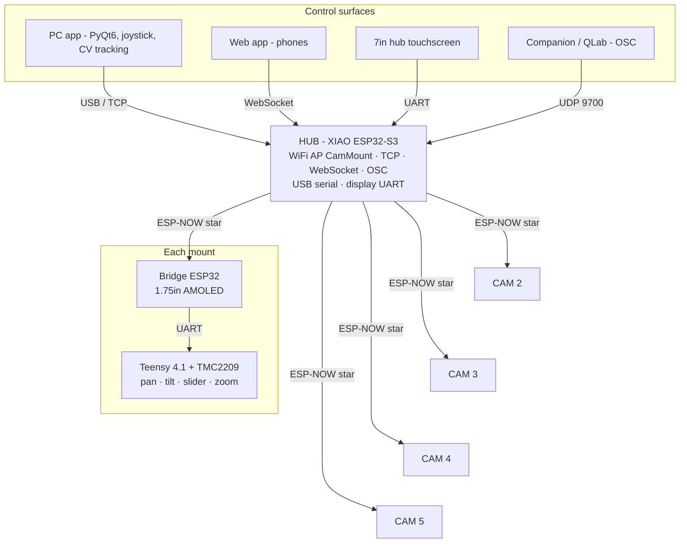

# PTS — Pan / Tilt / Slider

A five-mount motorised camera system for live video production — wireless,
self-healing, and controllable from everything in the booth: a PC app with
joystick and CV tracking, phones, a 7″ touchscreen, Stream Decks via Bitfocus
Companion, and QLab cue stacks.

> 📷 *TODO: hero photo of a mount / the rig in use*

📄 **[Two-page overview + OSC reference (PDF)](docs/PTS_Overview.pdf)** ·
🎛 **[Companion / QLab setup](docs/companion.md)** ·
📐 **[Look-at tracking design notes](DESIGN_V2.md)**

---

## What it does

- **Four axes per mount** — pan, tilt, slider, zoom (stepper or LANC) on
  TMC2209 silent drivers with StallGuard sensorless homing
- **Look-at tracking** — calibrate a subject's 3D position in two taps; the
  camera keeps aiming at it while the slider travels, and you can switch
  subjects mid-move from any controller
- **10 stored positions per mount** — recall from any surface at any speed
  preset; positions live on the mounts, so controllers can come and go
- **Zero-config pairing** — no MAC addresses, no per-unit firmware builds:
  hold a mount's screen, tap CAM 1–5, tap your hub. The hub learns mounts on
  first contact; conflicts resolve with one tap on the hub display
- **Self-healing** — autonomous recovery ladders on hub and mounts, idle
  maintenance restarts, watchdogs at every layer, and a motion-side dead-man:
  a mount stops within 500 ms of losing its control stream
- **Health telemetry** — every node reports heap, loop timing, link quality
  and reset cause into the PC log; degradation is visible hours before it
  becomes a symptom
- **Show-control** — OSC servers on both the hub and the PC app: every
  function on Companion buttons and QLab network cues

## Architecture



| Part | Hardware | Firmware |
|---|---|---|
| Hub | Seeed XIAO ESP32-S3 | [`firmware/esp32_hub`](firmware/esp32_hub) |
| Hub display | Waveshare ESP32-S3 Touch LCD 7″ (800×480, LVGL 9) | [`firmware/esp32_display`](firmware/esp32_display) |
| Mount bridge | Waveshare ESP32-S3 Touch AMOLED 1.75″ (466×466 round, LVGL 9) | [`firmware/esp_mount_amoled175`](firmware/esp_mount_amoled175) |
| Motion controller | Teensy 4.1 @ 600 MHz, TMC2209 ×4, TeensyStep4 | [`firmware/teensy41_mount`](firmware/teensy41_mount) |
| PC app | Python 3.11+, PyQt6, OpenCV (+ optional YOLO) | [`pc_app`](pc_app) |
| Web app | Served by the hub itself — join the `CamMount` WiFi | embedded in [`web_app.h`](firmware/esp32_hub/web_app.h) |

One binary per board type — **no per-unit configuration anywhere in source**.
Identity, pairing and calibration live in NVS/EEPROM, set from touchscreens.

## Hardware

> 🔧 *TODO — mechanics, motors and gearing, wiring diagrams, BOM, power.*
>
> In the repo already:
> - [`Print Files/`](Print%20Files) — STEP models (PT mount, slider)
> - [`PTS_4_PCB_2026-05-26.zip`](PTS_4_PCB_2026-05-26.zip) — PCB fabrication files

## Building the firmware

**Arduino IDE:** board settings and pinned library versions are documented in
[`libraries/README.md`](libraries/README.md) — copy the `libraries/` folders
into your Arduino libraries directory.

**Command line:** with `arduino-cli` installed (`brew install arduino-cli`),
one command compiles everything against the repo-pinned libraries:

```sh
tools/build.sh                   # all four targets
tools/build.sh hub display       # a subset
tools/build.sh flash hub [port]  # compile + upload
```

First-time bring-up: flash hub and mounts, power up, then pair each mount
from its own screen (hold ~1.5 s → CAM number → pick hub → SAVE). The hub
needs no action. See the pairing sections in the firmware sources.

## Running the PC app

```sh
cd pc_app
python3 -m pip install -r requirements.txt
python3 -m pip install opencv-contrib-python   # + `ultralytics` for YOLO tracking
python3 main.py
```

Connects to the hub over USB serial or TCP (`Config` dialog). Includes
joystick control, position management, look-at calibration, CV tracking, and
an OSC server for Companion/QLab (UDP 9700).

## Show control (Companion / QLab)

Point a **Generic: OSC** connection at the hub (`169.254.22.22:9700`) or the
PC app machine — same `/pts/...` addresses on both, full reference in
[`docs/companion.md`](docs/companion.md) and the [PDF](docs/PTS_Overview.pdf).

```
/pts/cam/2/goto 3        recall shot 3 on camera 2
/pts/cam/1/jog -400 0 0 0   (press) … /pts/cam/1/jog/stop (release)
/pts/estop               stop everything
```

## Development

- **Protocol single source of truth** — [`firmware/shared/protocol.h`](firmware/shared/protocol.h)
  is canonical; `tools/check_protocol.py` verifies the Python and JS mirrors
  and cross-checks the *compiled C encoders* against the Python decoders
  byte-for-byte (golden vectors). Runs from the pre-commit hook:
  `git config core.hooksPath .githooks` after cloning.
- **Mount simulator** — develop the PC app with zero hardware:
  `python3 tools/mount_sim.py`, point the app at `127.0.0.1`. Includes a
  fault-injection console (link wedges, NACKs, packet loss) and `--selftest`.
- **End-to-end OSC test** — `python3 tools/test_companion_osc.py` drives the
  real manager + OSC server against the simulator.

## Repository layout

```
firmware/
  shared/               canonical protocol + display UART framing
  esp32_hub/            hub: ESP-NOW star, AP, TCP/WS/OSC, web app, self-recovery
  esp32_display/        7" hub touchscreen (LVGL 9)
  esp_mount_amoled175/  mount bridge + round touchscreen, pairing UI
  teensy41_mount/       motion control: TMC2209, StallGuard, look-at solver
pc_app/                 PyQt6 controller: joystick, positions, look-at, CV, OSC
libraries/              pinned Arduino library versions (see its README)
tools/                  build.sh, protocol checker, simulator, tests, PDF gen
docs/                   Companion guide, overview PDF
Print Files/            STEP models        PTS_4_PCB_*.zip   PCB fab files
```

## License

**[PolyForm Noncommercial 1.0.0](LICENSE.md)** — in plain English:

- ✅ **Fork it, modify it, build it, share it** — free for any noncommercial
  purpose (personal, hobby, research, education), as long as the license and
  the copyright notice (which links back to this repository) stay with it.
- 💬 **Selling a product that uses any part of this?** That needs a separate
  commercial license — I'm open to discussion: contact
  [@cbradburne](https://github.com/cbradburne).

The license text in [LICENSE.md](LICENSE.md) is what governs; the bullets
above are just the summary.
